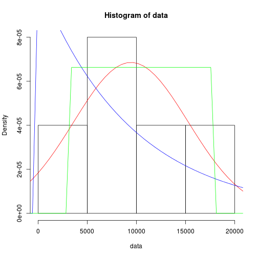

Distribution and Difference Significance of Preservation Methods by Bodysite
============================================================================

Data imported from txt tables to R.  


```r
feces <- read.csv("~/git/preservation_stats/presv_fig1_data/feces_fig1.csv")
oral <- read.csv("~/git/preservation_stats/presv_fig1_data/oral_fig1.csv")
skin <- read.csv("~/git/preservation_stats/presv_fig1_data/skin_fig1.csv")
```


Each Preservation method will be extracted from their respective data tables  
with a parser function for this porpose written in R named 'generate_vector()':  

Example:  
  from BodySite 'feces'

```r
feces_ultralow = parse_vector(data = feces, line = 1)
```


```
## [1] 18045  6458  2959 12129  7648
```

Then analyze through graphic of distribution to determine their   
distribution if any  

```r

# distribution_test() makes a summary of information from the data set and
# tries ploting a normal,uniform and exponential distribution graph from
# this data to fit the histogram of the sample.

# The aim of the graph-fit plot is to find ( if any) a distribution like
# behavior that could fit the data for testing and comparisons.

distribution_test(feces_ultralow)
```

 

As seen in the plot, the data doesnt fit any of the distribution   
to which they where tested. This left us with only one posibility   
being that our samples are to small, the only viable option is   
to use a student-t test.   

Since we need to find normality to used a student-t,   
Shapiro-Wilk Normality test is performed on each Presv. Method.


```r
shapiro.test(feces_ultralow)
```

```
## 
## 	Shapiro-Wilk normality test
## 
## data:  feces_ultralow
## W = 0.9592, p-value = 0.8023
```

```r

# Test P-value should be >= .95 to be consider a normal distribution thruogh
# this test.
```


